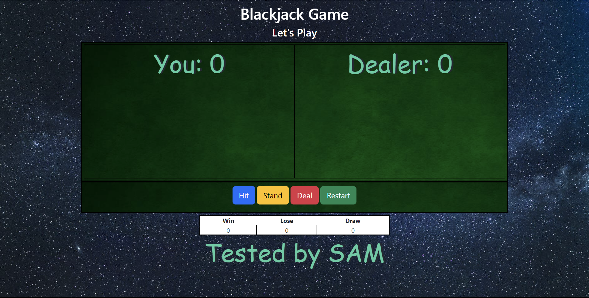
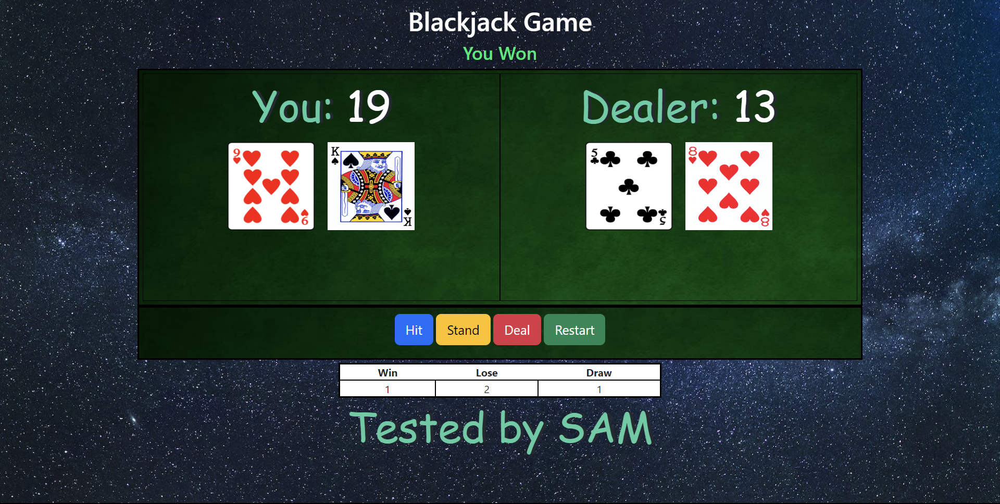
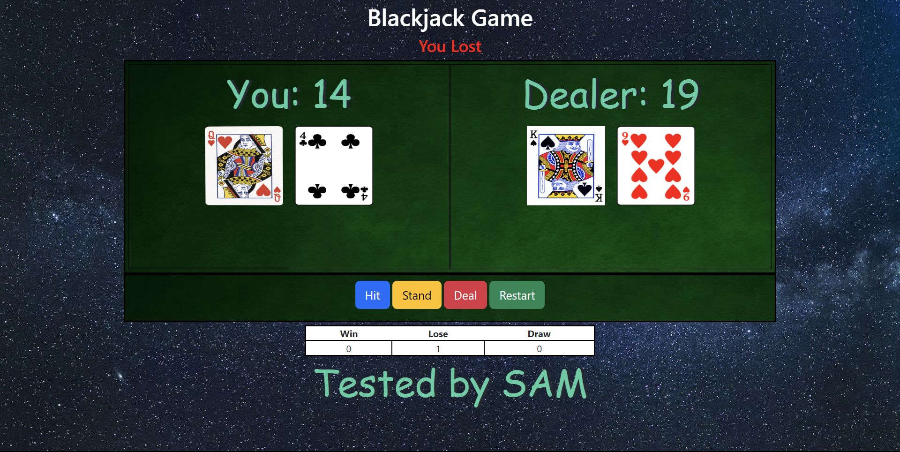
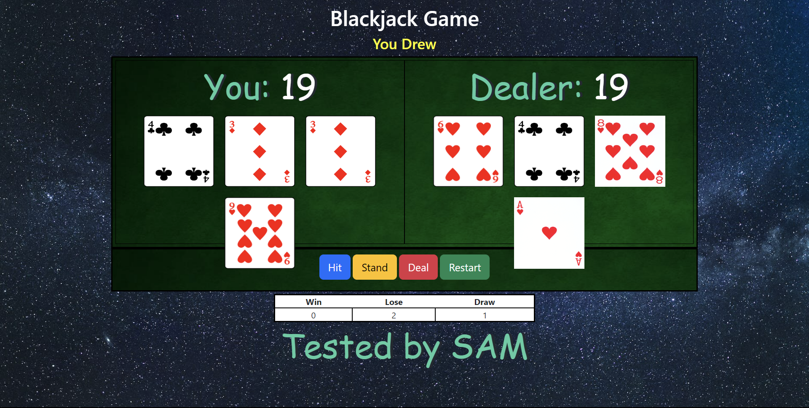

# Blackjack game

## Description

The player has to get a hand with a value as close to 21 as possible without going over.
A hand that goes over 21 is a bust.
The players in a blackjack game plays against the dealer. Each player has to beat the dealer's hand in order to win.

In blackjack game, the suits have no meaning.

1. Number cards have a value equal to their number.
2. All the picture cards (Jacks, Queens, and Kings) are worth 10.
3. Aces are worth 1.

## Tech Stacks Used

- HTML
- CSS
- JavaScript

## HOW TO PLAY

1. When the user clicks "Hit" button , a card is drawn
2. You can click on "Stand" when you no longer want to draw cards and then the dealer will draw it's cards
3. If the sum of cards of the dealer is greater than your sum , then you loses the game
4. If the sum of your cards is greater than 21 then you are busted and you loses the game
5. If your sum is greater than dealer's sum then you won the game
6. If Your Sum = Dealer's sum then the game draws
7. The table keeps a record of total wins,loses and draws
8. Click on "Restart" Button to start a new game
9. Click on "Deal" Button to clear the field

## Screenshots

 

 

 

