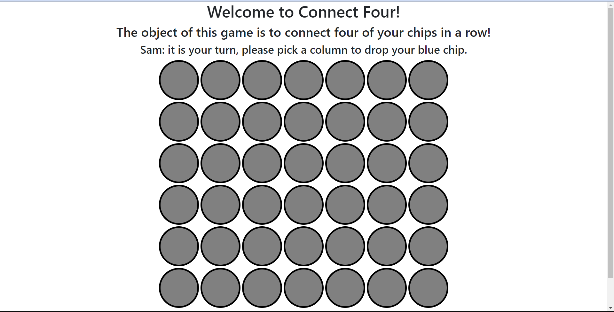
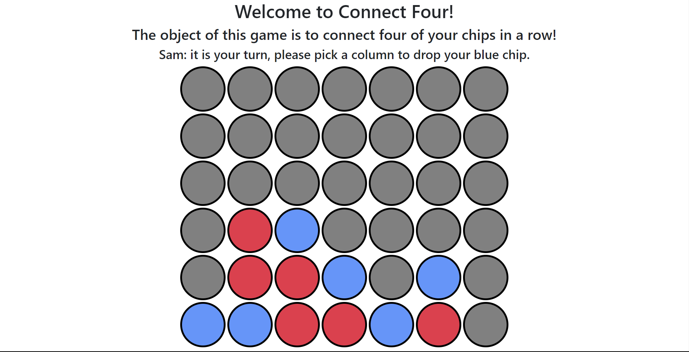
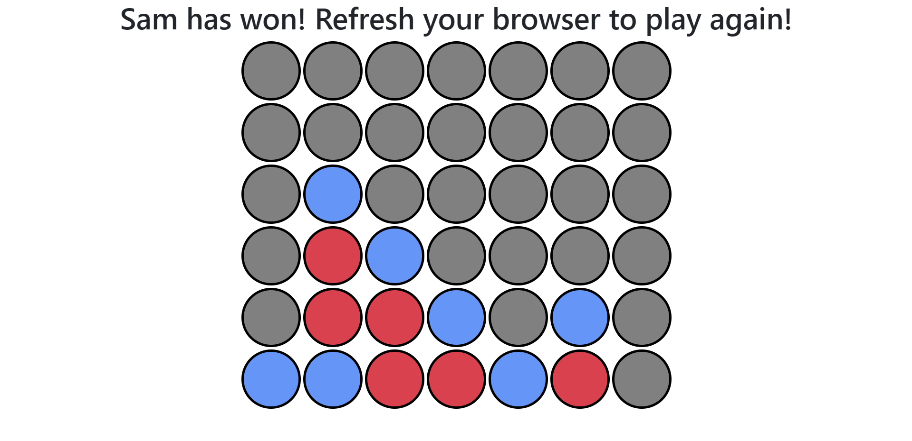

# Connect Four

## Description

- This is a simple game which can be played between two players.The player who connects the four bubbles first wins the game . The bubbles could be connected horizontally , vertically or diagonally.The players have to be together since multiplayer feature is not available .

## Technologies Used :

- HTML

- CSS

- Javascript

- JQuery

## Screenshots

 

 

