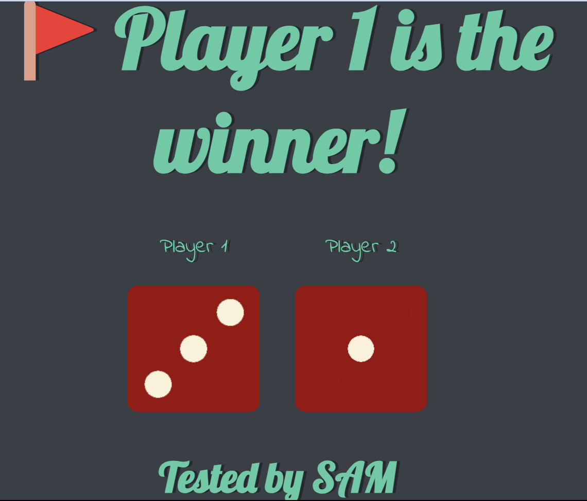

# Dice Game

It is a simple Dice Game. I'm testing it for better knowledge of basic HTML, CSS and JavaScript.

## How to use

- Both the players will choose there number( 1 or 2)
- Then just refresh the page and look at the results.

## Screenshots

