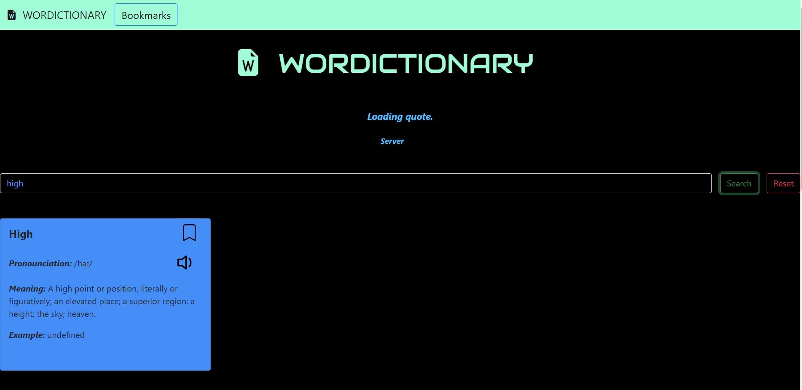
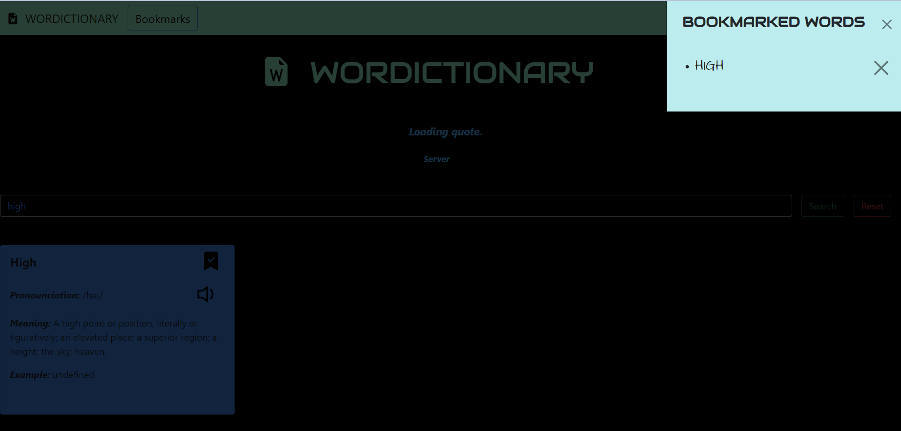
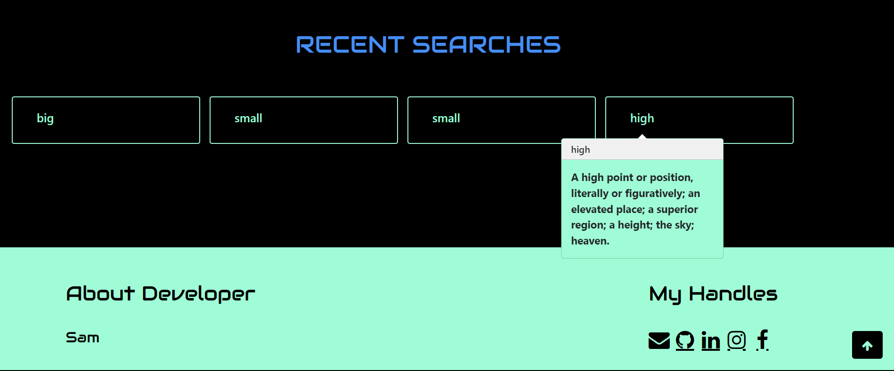

# Wordictionary

[Wordictionary](https://yash-barjatya.github.io/Dictionary/ "Wordictionary: A word dictionary website") : A _Word dictionary_ , where you can search for **_meaning_**, **_pronounciation_**, **_example_** (use of that word in sentences) of millions of words and also **_bookmark_** the words for future references.

---

It is written in :

- _HTML_
- _CSS_
- _JS_

---

1. **Search word and get not only the meaning of the word but also learn about its phonetic.**

---

2. **Bookmark diificult words.**

---

3. **Hover over recent searches to get a quick definiton of the word.**

---

## Hope you like it !!
