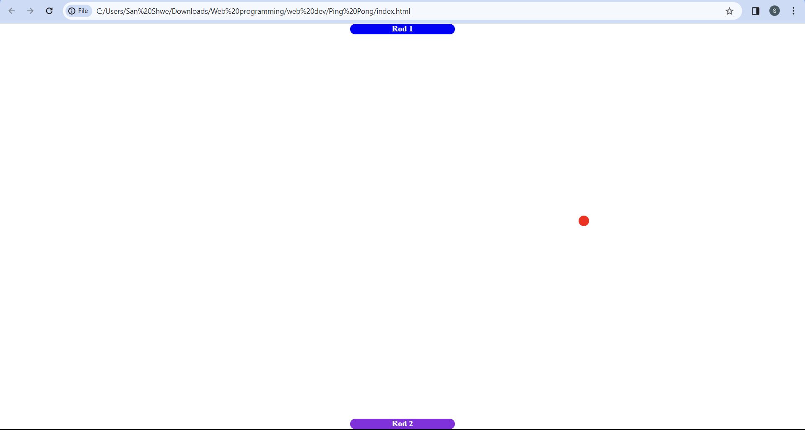
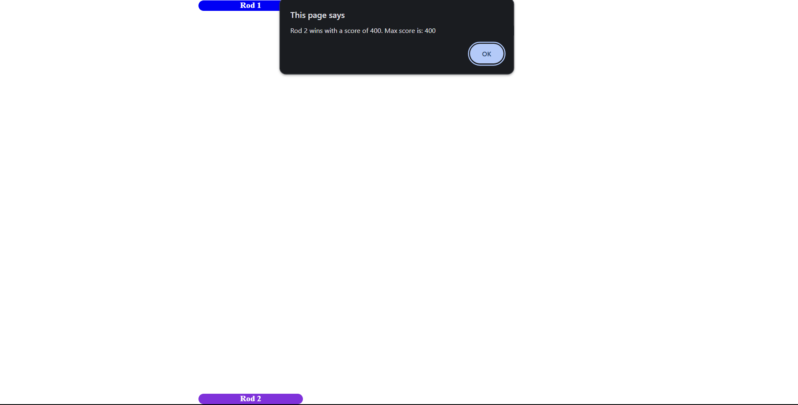

# Ping Pong Game

I created this to understand more of the JavaScript

## How to Play

Use "A" and "D" keywords to move rod and press "enter" to start a game.

## Tech Stacks Used

- HTML
- CSS
- JavaScript

## Screenshots

 

