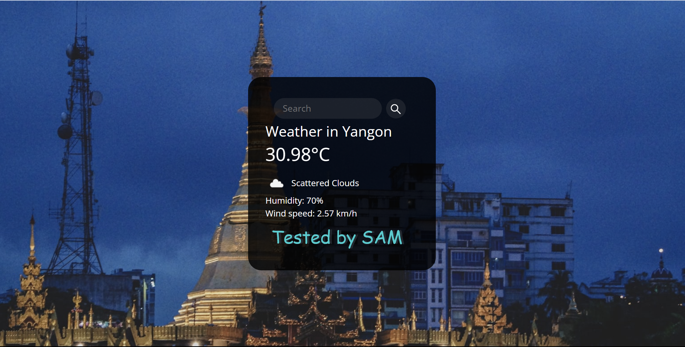
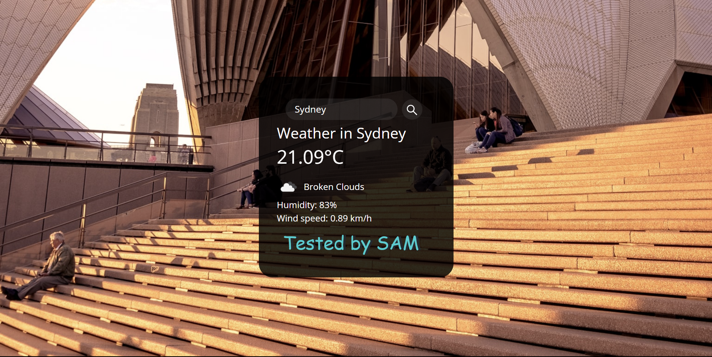
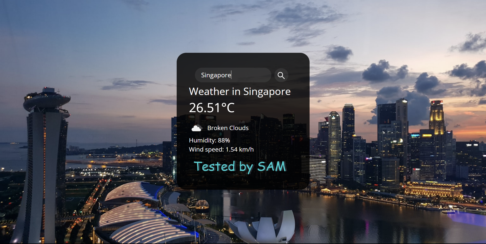

# Weather Application

Simple Weather app written in HTML, CSS, and JavaScript using the APIs for fetching weather and geolocation information.

## Tech Stacks Used

- HTML
- CSS
- JavaScript
- Open Weather API
- Unsplash API

## API Used

- https://openweathermap.org/api
- https://source.unsplash.com/1600x900/?nature,water,landscape

## Screenshots

 

 

